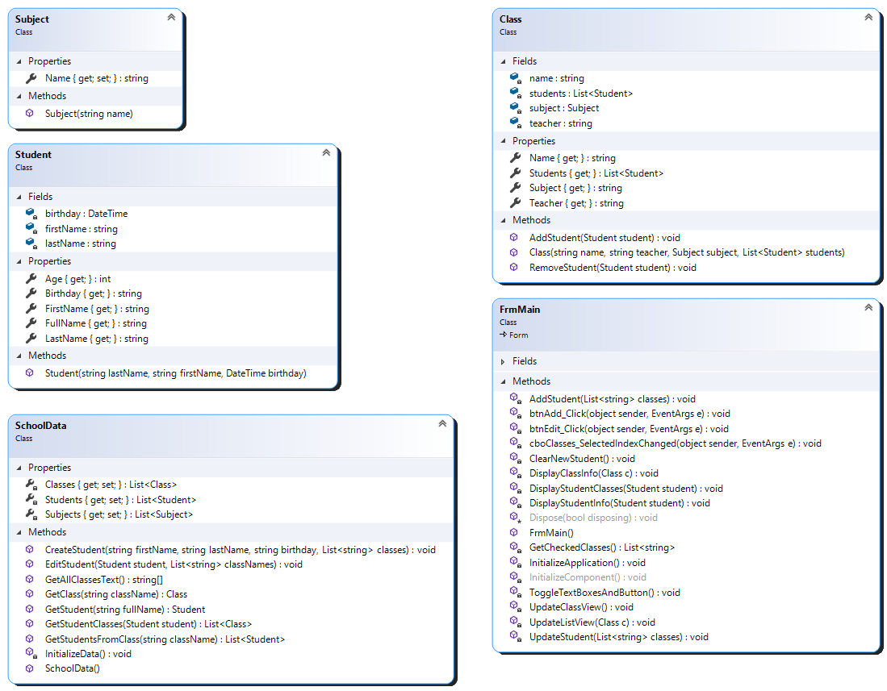
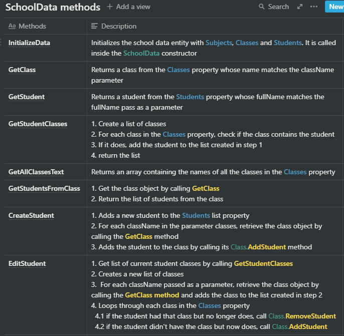
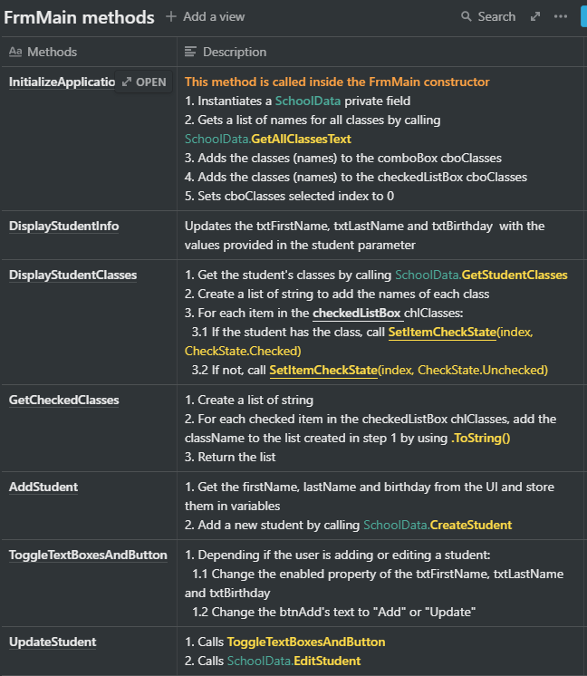
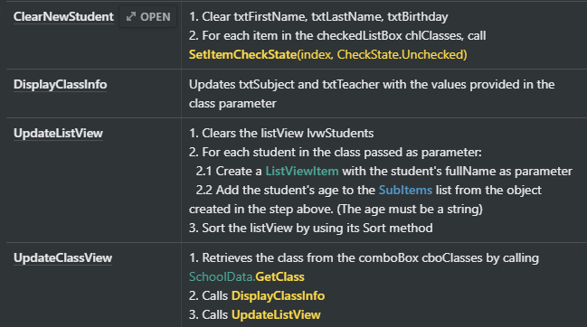

# Classes

This is a winforms app that manages school classes. User can create students and update their classes.

The classes to implement can be found below. Be sure to check the class diagram for a global view of the application.

## Subject

> Note : the setter should be private

## Student

| Property | Description                                                                 |
| -------- | --------------------------------------------------------------------------- |
| Age      | Calculates and returns the student's age                                    |
| FullName | Returns the student's name with the following format: "LastName, FirstName" |

## Class

| Methods       | Description                                |
| ------------- | ------------------------------------------ |
| AddStudent    | Adds an existing student to the class      |
| RemoveStudent | Removes an existing student from the class |

## SchoolData

  
Property

  
Class

  
Method

 

## FrmMain

